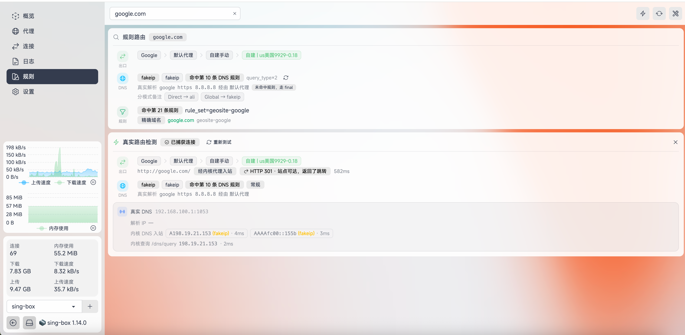

# ClashBoard-singbox

ClashBoard-singbox 是一个基于 `Vue 3 + TypeScript + Vite` 的 Clash 面板，面向 `Clash API`、`Mihomo`、`OpenClash`、`Nikki` 和 `sing-box` 的运行态管理、观测与排错。

> **声明**：本项目基于 [AnGe-ClashBoard](https://github.com/liandu2024/AnGe-ClashBoard) 与开源项目 [zashboard](https://github.com/Zephyruso/zashboard) 进行二次开发，在此感谢两位上游作者的付出。两个上游项目均使用 `MIT License`，本项目沿用该许可证并保留原许可证声明，相关授权信息见下文「授权」与仓库中的 [LICENSE](LICENSE) 文件。

## 项目特点

- 支持 Clash API、Mihomo、OpenClash、Nikki、sing-box
- 支持 SQLite 持久化配置，切换浏览器后仍可保留配置
- 支持背景图服务端持久化
- 支持图标上传、拖拽、复制和预览
- 支持规则缓存、域名/IP/关键字规则查询、链路展示和兜底规则判断
- 支持后端中转控制器数据，公网访问面板时无需直接暴露控制器端口
- 支持 Docker 一键部署，适合个人和局域网环境
- 针对 sing-box 的适配与增强：
  - 读取内核运行配置，规则路由展示 DNS 推断（命中哪条 DNS 规则、使用哪个 DNS 服务器、fakeip 模式下的真实上游、分模式备注），并支持一键刷新
  - 真实路由检测附带真实 DNS 结果（内核 DNS 入站直查的 A/AAAA 结果、延迟、fakeip 标注，以及内核 `/dns/query` 结果），方便与规则预测对照
  - 探测请求优先经本机代理入站 / 内核局域网代理入站发出，dashboard 主机流量不经过内核时依然可以完成检测

## 功能预览

### 策略穿透


策略穿透可以直接展开策略组内部的节点和子策略链路，便于快速查看当前命中策略、候选节点状态和最终出口。

### 规则穿透


规则穿透支持按域名、IP 和关键字查询规则命中结果，并展示规则来源、匹配类型、策略链路和最终节点，方便排查分流问题。

### 图标管理



图标管理支持自定义图标映射、上传、复制和删除，可分别为策略组、节点组和其他项目配置专属图标。

## 一键安装

安装前提：

- 服务器已安装 Docker
- 可以访问 `ghcr.io`
- 需要对外开放你准备使用的面板端口

默认安装目录：`/opt/clashboard-singbox`

默认数据目录：`/opt/clashboard-singbox/data`

默认端口：`2048`

```bash
curl -fsSL https://raw.githubusercontent.com/lzxpm/ClashBoard-singbox/main/scripts/install.sh | bash
```

安装完成后访问：

```bash
http://<你的服务器IP>:2048
```

## 自定义端口部署

例如部署到 `8080`：

```bash
curl -fsSL https://raw.githubusercontent.com/lzxpm/ClashBoard-singbox/main/scripts/install.sh | bash -s -- 8080
```

## 无损升级

升级会保留现有数据目录，不会删除你的配置、背景图和规则缓存。

默认保留目录：

```bash
/opt/clashboard-singbox/data
```

仍然建议你先在面板里执行一次“导出设置”，额外留一份配置备份，以防意外情况。

```bash
curl -fsSL https://raw.githubusercontent.com/lzxpm/ClashBoard-singbox/main/scripts/update.sh | bash
```

如果你之前是通过一键脚本安装，并且没有手动改过 `/opt/clashboard-singbox/compose.yaml` 和 `.env` 的结构，这个升级方式就是原位无损升级。

## 彻底卸载

卸载会删除：

- 容器
- 镜像
- `/opt/clashboard-singbox`
- 本地数据目录

```bash
curl -fsSL https://raw.githubusercontent.com/lzxpm/ClashBoard-singbox/main/scripts/uninstall.sh | bash
```

## Docker 运行

推荐直接使用已发布到 GHCR 的镜像：

```bash
ghcr.io/lzxpm/clashboard-singbox:latest
```

已发布镜像支持 `linux/amd64`、`linux/arm64` 和 `linux/arm/v7`。

手动运行：

```bash
docker run -d \
  --name clashboard-singbox \
  -p 2048:2048 \
  -v ./data:/app/data \
  --restart unless-stopped \
  ghcr.io/lzxpm/clashboard-singbox:latest
```

上面的 `--restart unless-stopped` 表示容器会在 Docker 服务重启后自动拉起，除非你手动停止它。

## Docker 无损升级

如果你是通过 `-v ./data:/app/data` 这类挂载方式运行，升级镜像时会保留原有数据目录，属于无损升级。

仍然建议先在面板里导出一次设置，额外备份配置数据后再升级。

```bash
docker pull ghcr.io/lzxpm/clashboard-singbox:latest

docker stop clashboard-singbox
docker rm clashboard-singbox

docker run -d \
  --name clashboard-singbox \
  -p 2048:2048 \
  -v ./data:/app/data \
  --restart unless-stopped \
  ghcr.io/lzxpm/clashboard-singbox:latest
```

如果你之前使用了自定义端口、不同的容器名，或不同的数据目录挂载，请把上面的参数改成你当前正在使用的那一套。

如果你只是通过一键脚本安装，优先使用上面的 `update.sh`，会更省事。

健康检查：

```bash
http://127.0.0.1:2048/api/health
```

## 服务端持久化

项目内置轻量 Node 服务，用于保存：

- 设置
- 背景图
- 规则缓存
- 内核运行配置缓存（DNS 推断使用）

默认数据库路径：

```bash
./data/zashboard.sqlite
```

可通过环境变量覆盖：

```bash
ZASHBOARD_DB_PATH
```

## 规则查询

规则页支持按域名查询命中的规则来源，并展示实际策略链路。

当前支持：

- 文本规则源缓存
- `.mrs` 域名规则集解析
- 规则顺序排序
- 兜底规则检测
- 根据 YAML 中的 `interval` 自动更新缓存
- 刷新规则时显示累计规则数量与手动停止

规则源需要配置代理端 OpenWrt 的 SSH 连接。服务会通过 SSH 实时读取代理端当前配置，不读取本机 OpenClash 文件，也不内置规则源模板。

可在页面的“修改后端配置”弹窗里，为对应后端填写规则源类型、SSH 端口、账号和密码；规则源 SSH 主机直接使用该后端的“主机”。也可以通过环境变量预设：

```bash
ZASHBOARD_OPENWRT_SSH_HOST
ZASHBOARD_OPENWRT_SSH_PORT
ZASHBOARD_OPENWRT_SSH_USER
ZASHBOARD_OPENWRT_SSH_PASSWORD
ZASHBOARD_RULE_SOURCE_PLUGIN
```

服务会自动识别代理端的 OpenClash、Nikki 或 sing-box（含 Momo）：

- OpenClash：读取远程 `/etc/config/openclash`，解析其中真实的 `option config_path`，再读取对应 YAML 的 `rule-providers`。
- Nikki：优先从远程进程命令行和 `/etc/config/nikki` 提取实际 YAML 路径，再校验其中的 `rule-providers`。
- sing-box / Momo：从远程进程命令行捕获 `-D` / `-c` 定位运行中的 `config.json`，读取其中的 `route.rule_set` 与 `dns` 配置。

OpenClash 远程 UCI 路径不在默认位置时可覆盖：

```bash
ZASHBOARD_OPENCLASH_UCI_PATH
ZASHBOARD_OPENCLASH_CONFIG_DIR
```

## 项目结构

- `src/`：前端代码
- `server/`：本地持久化与规则缓存后端
- `data/`：运行时数据目录
- `public/`：静态资源
- `scripts/`：安装、升级、卸载脚本
- `readme/`：README 展示图片

## 授权

本项目基于以下上游项目二次开发：

- [AnGe-ClashBoard](https://github.com/liandu2024/AnGe-ClashBoard)（`MIT License`）
- [zashboard](https://github.com/Zephyruso/zashboard)（`MIT License`）

因此你可以在保留原许可证声明的前提下继续修改、发布和分发本项目。

请保留仓库中的 [LICENSE](LICENSE) 文件以及本页对上游项目的署名说明。

## 致谢

- [AnGe-ClashBoard](https://github.com/liandu2024/AnGe-ClashBoard) 及其作者
- [zashboard](https://github.com/Zephyruso/zashboard) 及其作者
- Clash / Mihomo / sing-box 生态项目与规则集作者
